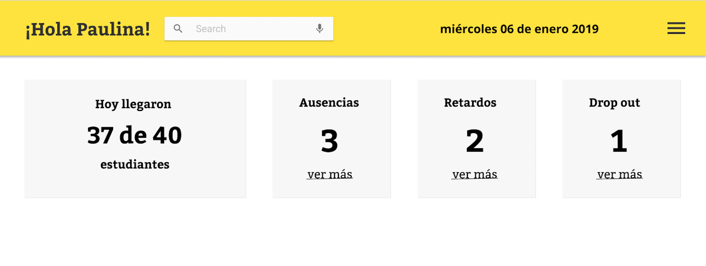

# Organa

En Laboratoria estamos buscando una manera eficiente de enterarnos quienes asistieron al área de trabajo cada día. Hasta ahora se ha llevado una asistencia manual pero sabemos que toma tiempo valioso.

La idea de este proyecto es solucionar el registro de asistencia con una aplicación web.

La solución que proponemos consiste en usar una webcam para leer [códigos QR](https://es.wikipedia.org/wiki/C%C3%B3digo_QR) que indetifiquen a cada estudiante que va llegando y se almacene en una base de datos por día.

Como primera iteración consideramos que pueda guardar la asistencia y pueda mostrar en una interface cuántas estudiantes asistieron ese día y cuantas inasistencias hubieron.

El listado de estudiantes puede ser indicado desde un JSON o haciendo un fetch a `https://laboratoria-la.firebaseapp.com/cohorts/gdl-2019-01-bc-core-gdl-002/users`.

## UI

Compartimos un prototipo de alta fidelidad que se usó en otra oportunidad, usarlo como referencia:

## Flujo con los Códigos QR

Se espera que cada estudiante tenga un código QR que tiene un identificador de ellas como por ejemplo su correo electrónico, al llegar al área de trabajo cada estudiante mostrará su código QR a la webcam de una laptop y esta laptop registrará la asistencia de ella para ese día.

## Recomendaciones

- Si planeamos usar React podemos usar estos 2 libraries para el manejo de QRs: https://www.npmjs.com/package/react-qr-scanner y https://www.npmjs.com/package/react-qr-svg
- Usar Firebase para la persistencia de la data.
- Usar herramientas online para la creación de QRs de prueba (si lo consideran necesario) ej: https://www.the-qrcode-generator.com/

## ¿Por qué el nombre Organa?

Leia Organa es la general de la resistencia en el universo de Star Wars, nos gusta pensar que está muy pendiente de los intergrantes de su equipo!
